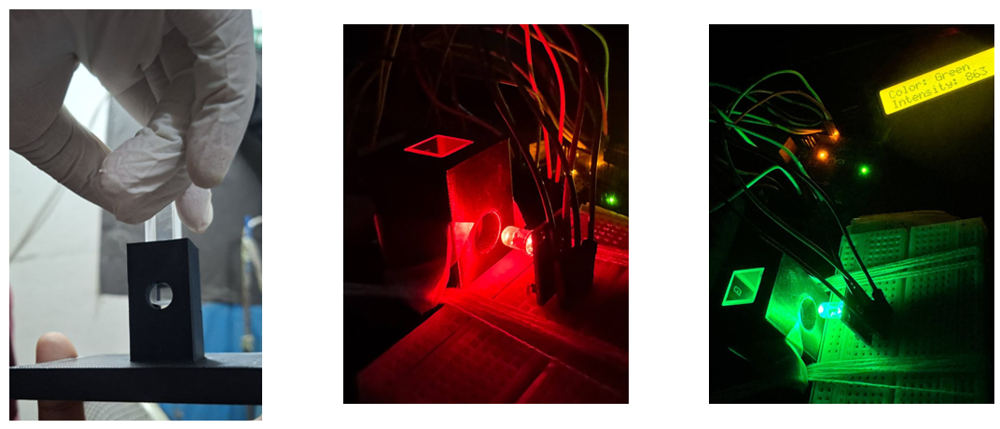
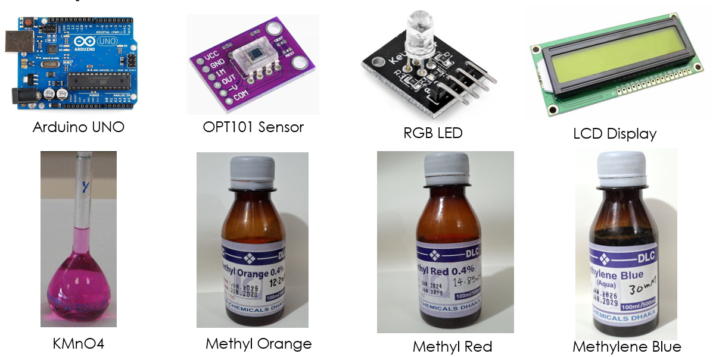
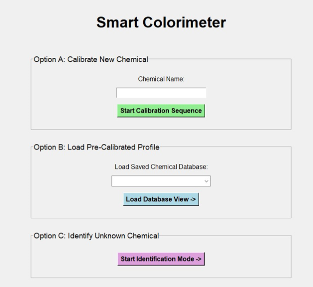
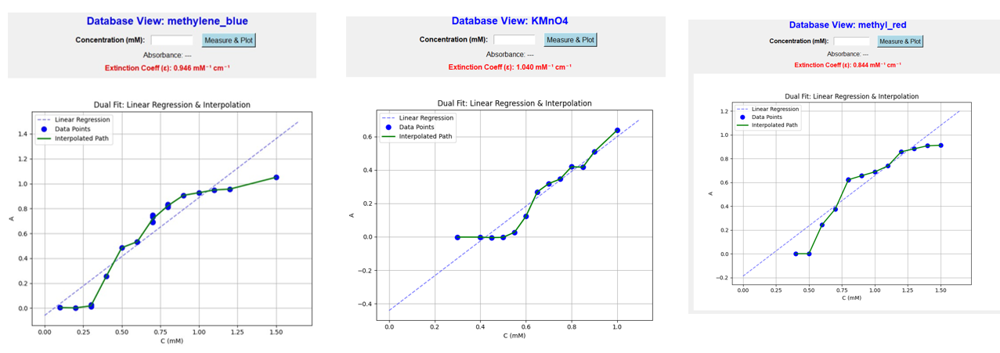

# Smart Colorimeter for Automated Concentration Analysis & Chemical Identification

**Course:** EEE 460 - Optoelectronics Laboratory  
**Domains:** Optoelectronics, Hardware-Software Co-Design, Optical Spectroscopy, GUI Development  

**For detailed result, read the report**  

## Project Overview
This project presents a low-cost, fully automated Smart Colorimeter engineered for precise concentration analysis and chemical identification. Built to replace expensive commercial laboratory equipment, the system leverages a custom 3D-printed optical chamber, an OPT101 photodiode, and a Python-based Graphical User Interface (GUI). It empirically verifies the Beer-Lambert Law while solving the issue of high-concentration spectral deviation through an advanced piece-wise linear interpolation algorithm.

## Key Features & Software Capabilities
* **Automated Peak Detection:** The system autonomously sweeps a 6-LED optical array to locate the peak absorbance wavelength for any new chemical, eliminating manual filter swapping.
* **Dual-Fit Analytical Algorithm:** Rather than relying solely on standard linear regression, the software utilizes a custom Linear Interpolation algorithm to dynamically map the true physical absorbance curve, achieving highly precise calculations for unknown concentrations.
* **Optical Fingerprinting:** The system acts as a chemical scanner. By cross-referencing an unknown sample's absorbance signature against stored database curves, it instantly identifies the specific dye.

## Hardware Setup & Materials
The prototype was developed with a total hardware budget of ~4,630 BDT.
* **Microcontroller:** Arduino UNO R3 (Handles real-time sensor polling and LED PWM control).
* **Optical Sensors & Emitters:** OPT101 Photodiode Sensor Module, 6-Color RGB LED Array.
* **Mechanical:** Custom AutoCAD-designed and 3D-printed light-proof cuvette/sensor housing.

*Figure: The complete physical hardware setup including the light-proof optical housing and Arduino circuitry.*

*Figure: The chemical dyes and cuvettes utilized for concentration analysis and fingerprinting.*

## Software Interface (GUI)
The system replaces manual calculations with a custom Python (Tkinter) interface that automatically plots data, manages databases, and visualizes calibration curves in real-time.

*Figure: The main dashboard of the custom Python GUI, offering three primary analytical modes: Calibration, Unknown Measurement, and Dye Identification.*

## Experimental Results & Database
The device was rigorously tested against four primary chemical dyes: Methyl Orange, Methyl Red, Methylene Blue, and KMnO4.
* **Measurement Accuracy:** The interpolation algorithm achieved an extremely low margin of error (0.01 mM to 0.03 mM) when testing random unknown concentrations.
* **Identification Reliability:** The optical fingerprinting protocol correctly identified the chemical dye in 100% of the test cases against the comparative calibration database.

*Figure: The automatically generated comparative calibration curves mapping Absorbance (A) vs. Concentration (mM) for all tested chemicals.*
linear light scattering at extreme concentrations.
